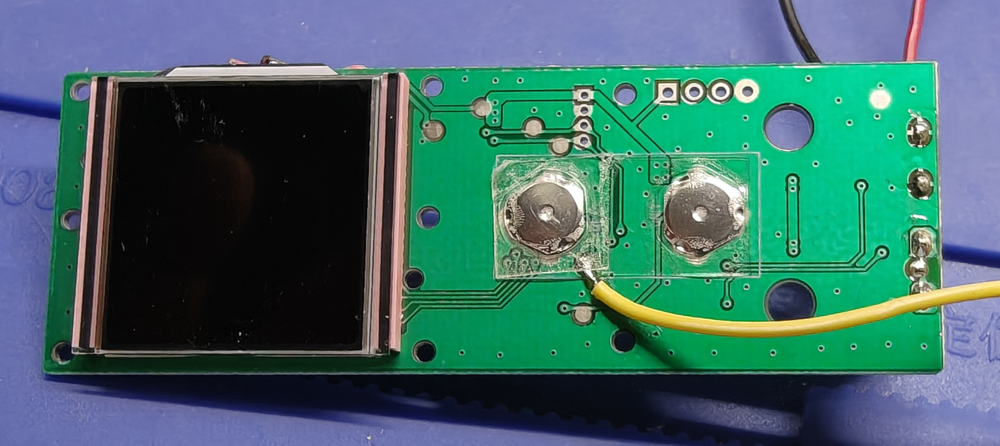
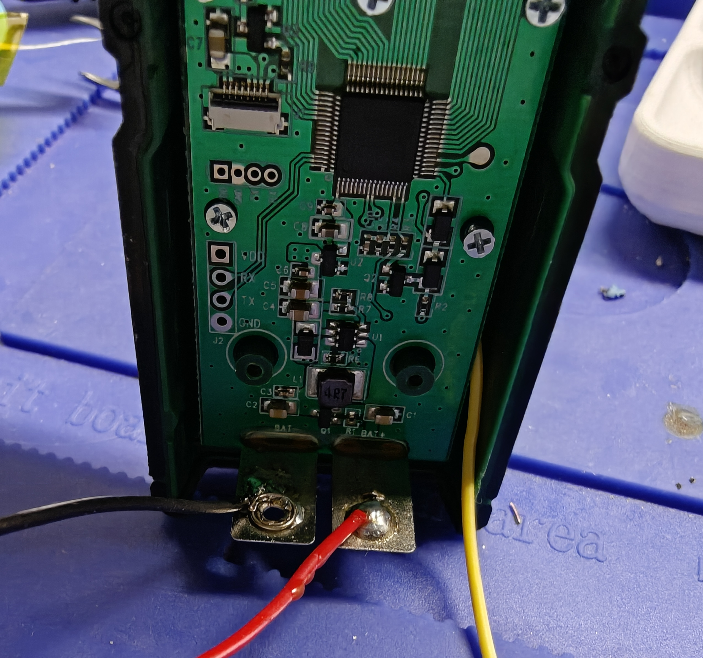
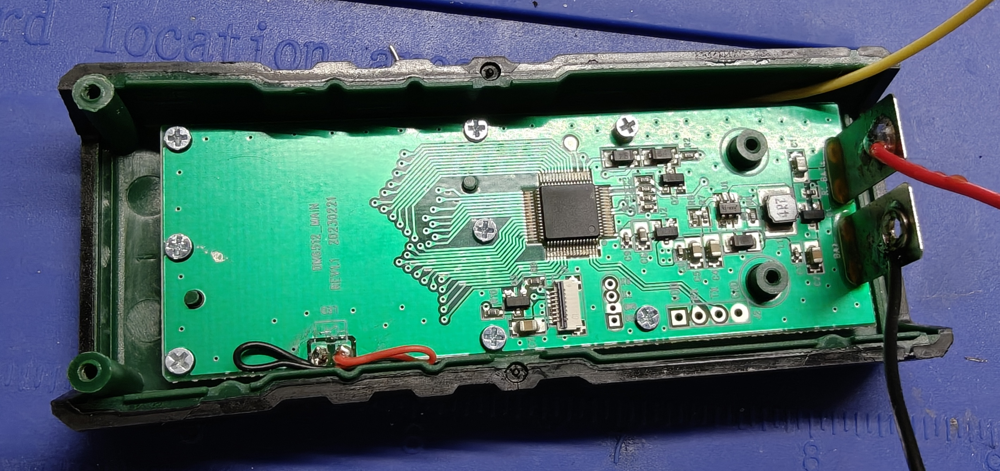
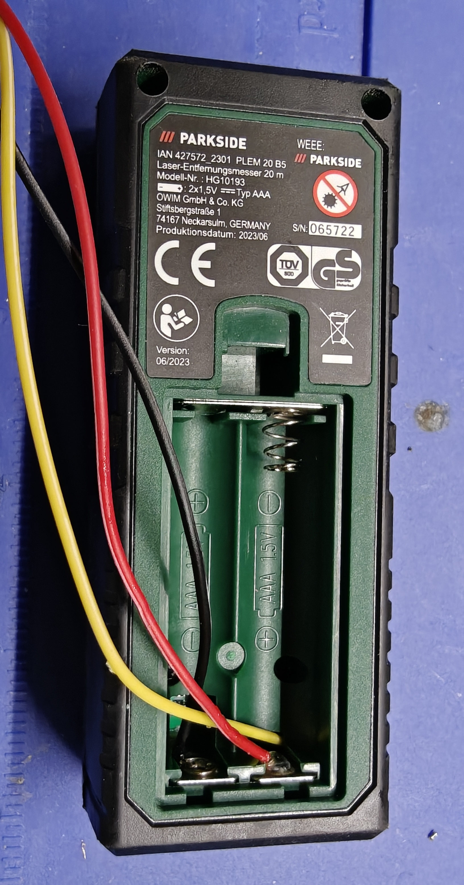
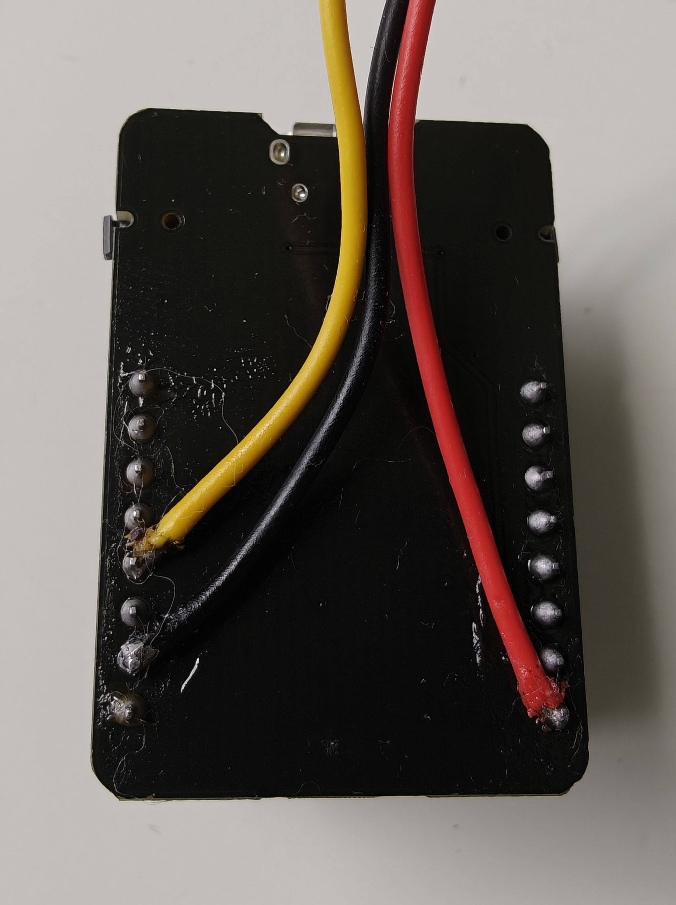
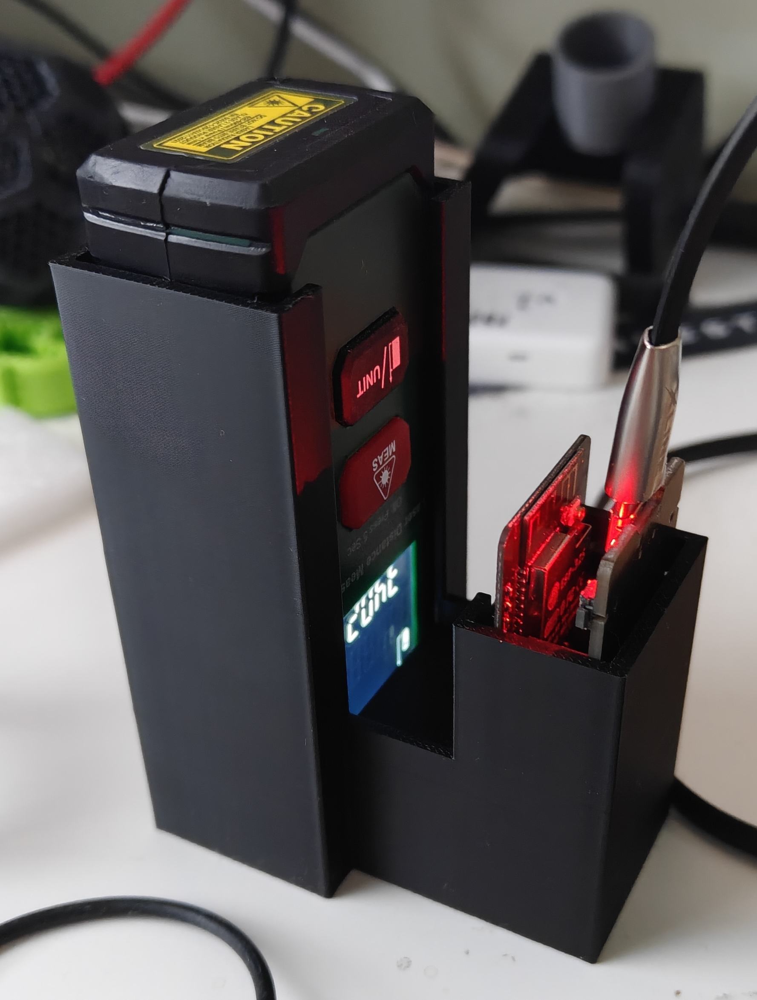
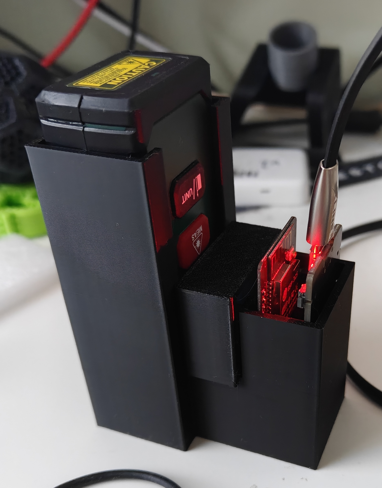

# Hardware Example: Water Tank Level Sensor

This example shows how to use `digit_number` to measure water tank depth with a laser distance meter.

## Device: PARKSIDE HG10193 Laser Distance Meter

The meter's measurement button is wired to **GPIO13** on the ESP32-CAM, allowing the firmware to trigger measurements via `trigger_pin`.

### Button wiring

Solder two wires directly to the button contacts inside the meter. Connect them to GPIO13 and GND on the ESP32. The `trigger_pin` config sends a HIGH pulse to GPIO13, which shorts the button contacts and triggers a measurement.

| hardware_1.jpg | hardware_2.jpg |
|---|---|
|  |  |

| hardware_3.jpg | hardware_4.jpg |
|---|---|
|  |  |



### Power

The meter originally ran on 2× AAA 1.5V batteries (~3V). The **3.3V pin of the ESP32** powers it directly — no separate supply needed.



### Camera mounting

The ESP32-CAM is mounted **4 cm from the display**. At this distance the image is intentionally blurred, but `digit_number` handles this — it uses area brightness averaging, not edge detection. Close mounting maximises digit size in the frame.

| Camera mount | Display view |
|---|---|
|  |  |

## Enclosure

A 3D-printed enclosure (100 mm diameter) houses the ESP32-CAM and the laser meter together:

- Hole at the bottom for the laser beam to exit downward
- 230V AC input + USB power supply inside
- Fits inside a **110 mm PVC drainage pipe**

The pipe is drilled at several points (especially near the bottom) so water flows freely in and out, keeping the internal water level equal to the tank level.

A **float** is placed inside the pipe. The laser reflects off the float surface — a stable, flat target that moves with the water level and gives repeatable readings regardless of water surface turbulence.

Total assembly height in this installation: **~2.5 m**.

## ESPHome config fragment

```yaml
sensor:
  - platform: digit_number
    name: "Water Level"
    camera_id: my_camera
    unit_of_measurement: "mm"
    update_interval: 2s
    trigger_pin: GPIO13
    burst_mode:
      count: 3
      trigger_interval: 10s
      rest_duration: 5min
      trigger_pulse: 300ms
    digits:
      # calibrate from your snapshot
      - a: [195, 175]
        d: [195, 265]
        b: [250, 200]
      # ... remaining digits
```

See the main [README](../README.md) and [`example_config.yaml`](../example_config.yaml) for full pin configuration.
